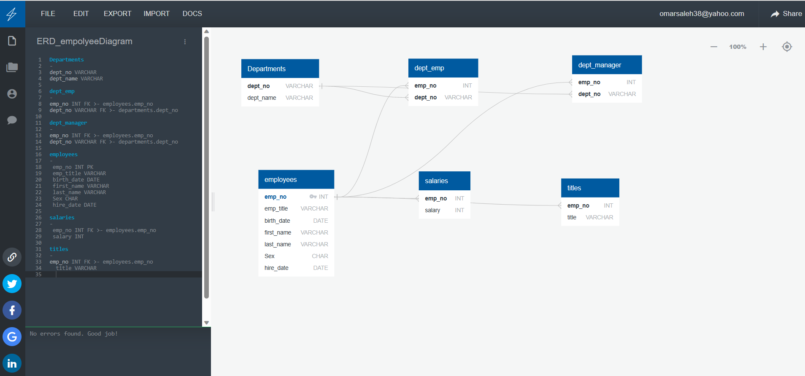

# sql-challenge
Background
It’s been two weeks since you were hired as a new data engineer at Pewlett Hackard (a fictional company). Your first major task is to do a research project about people whom the company employed during the 1980s and 1990s. All that remains of the employee database from that period are six CSV files.

For this project, you’ll design the tables to hold the data from the CSV files, import the CSV files into a SQL database, and then answer questions about the data. That is, you’ll perform data modeling, data engineering, and data analysis, respectively.
Data Modeling
Inspect the CSV files, and then sketch an Entity Relationship Diagram of the tables. To create the sketch, feel free to use a tool like QuickDBDLinks to an external site..

Data Engineering
Use the provided information to create a table schema for each of the six CSV files. Be sure to do the following:

Remember to specify the data types, primary keys, foreign keys, and other constraints.

For the primary keys, verify that the column is unique. Otherwise, create a composite keyLinks to an external site., which takes two primary keys to uniquely identify a row.

Be sure to create the tables in the correct order to handle the foreign keys.

Import each CSV file into its corresponding SQL table.
Data Analysis
List the employee number, last name, first name, sex, and salary of each employee.

List the first name, last name, and hire date for the employees who were hired in 1986.

List the manager of each department along with their department number, department name, employee number, last name, and first name.

List the department number for each employee along with that employee’s employee number, last name, first name, and department name.

List first name, last name, and sex of each employee whose first name is Hercules and whose last name begins with the letter B.

List each employee in the Sales department, including their employee number, last name, and first name.

List each employee in the Sales and Development departments, including their employee number, last name, first name, and department name.

List the frequency counts, in descending order, of all the employee last names (that is, how many employees share each last name).

Table_Schema.sql

-- Drop Tables if Existing
DROP TABLE IF EXISTS departments;
DROP TABLE IF EXISTS dept_emp;
DROP TABLE IF EXISTS dept_manager;
DROP TABLE IF EXISTS employees;
DROP TABLE IF EXISTS salaries;
DROP TABLE IF EXISTS titles;

-- Create the table schema for each CSV files

-- Create the table for departments

CREATE TABLE departments (
	dept_no VARCHAR(30) NOT NULL,
	dept_name VARCHAR(30) NOT NULL,
	    CONSTRAINT "pk_departments" PRIMARY KEY (
        "dept_no")
);

-- Create the table for Dept_Emp
CREATE TABLE dept_emp (
    emp_no INTEGER   NOT NULL,
    dept_no VARCHAR(30)   NOT NULL
);

-- Create the table for Dept_Manager

CREATE TABLE dept_manager (
  emp_no VARCHAR NOT NULL,
  dept_no VARCHAR(30) NOT NULL
);

CREATE TABLE employees (
  emp_no INT PRIMARY KEY,
  emp_title VARCHAR(30),
  birth_date DATE,
  first_name VARCHAR(30),
  last_name VARCHAR(30),
  Sex CHAR(1),
  hire_date DATE
);

-- Create the table for Salaries

CREATE TABLE salaries (
  emp_no INT NOT NULL,
  salary INT NOT NULL
);

-- Create the table for Titles

CREATE TABLE titles (
  emp_no VARCHAR NOT NULL,
  title VARCHAR(100) NOT NULL
);

Queries

--Start SQL queries
--1 List the employee number, last name, first name, sex, and salary of each employee

SELECT employees.emp_no, employees.last_name, employees.first_name, employees.Sex, salaries.salary
FROM employees
LEFT JOIN salaries
ON employees.emp_no = salaries.emp_no
ORDER BY emp_no

--2List the first name, last name, and hire date for the employees who were hired in 1986

SELECT first_name, last_name, hire_date
FROM employees
WHERE hire_date >= '1986-01-01' AND hire_date <= '1986-12-31';

--3 List the manager of each department along with their department number, department name, 
--employee number, last name, and first name

SELECT dm.emp_no, dm.dept_no, d.dept_name, e.last_name, e.first_name
FROM dept_manager dm
JOIN departments d USING (dept_no)
JOIN employees e ON dm.emp_no::integer = e.emp_no;

--4List the department number for each employee along with that employee’s employee number, 
--last name, first name, and department name

SELECT de.emp_no, e.last_name, e.first_name, de.dept_no, d.dept_name
FROM dept_emp de
JOIN employees e USING (emp_no)
JOIN departments d USING (dept_no);

--5List first name, last name, 
--and sex of each employee whose first name is Hercules and whose last name begins with the letter B.

SELECT * FROM employees
WHERE first_name = 'Hercules' AND last_name like 'B%';

--6List each employee in the Sales department, including their employee number, 
--last name, and first name.

SELECT e.emp_no, e.last_name, e.first_name
FROM employees e
JOIN dept_emp de USING (emp_no)
JOIN departments d USING (dept_no)
WHERE d.dept_name = 'Sales';

--7List each employee in the Sales and Development departments, including their employee number, 
--last name, first name, and department name.

SELECT e.emp_no, e.last_name, e.first_name, d.dept_name
FROM employees e
JOIN dept_emp de USING (emp_no)
JOIN departments d USING (dept_no)
WHERE d.dept_name IN ('Sales', 'Development');

--8List the frequency counts, in descending order, of all the employee last names 
--(that is, how many employees share each last name).

SELECT last_name, COUNT(*) AS frequency
FROM employees
GROUP BY last_name
ORDER BY frequency DESC;